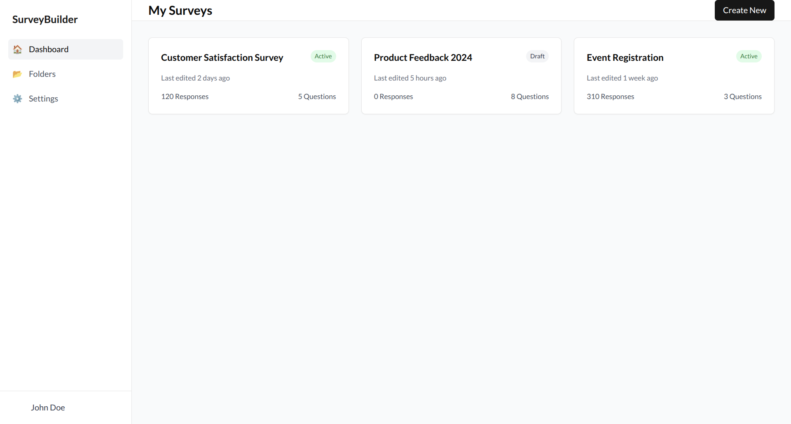
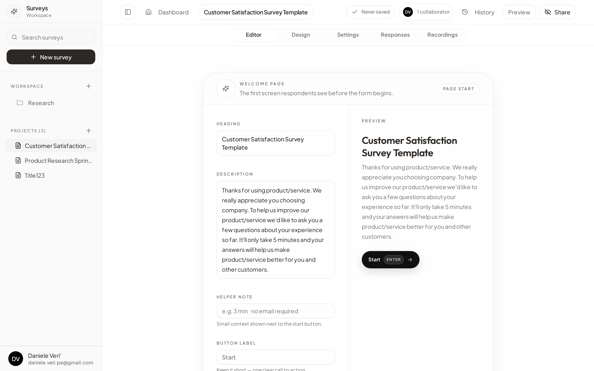
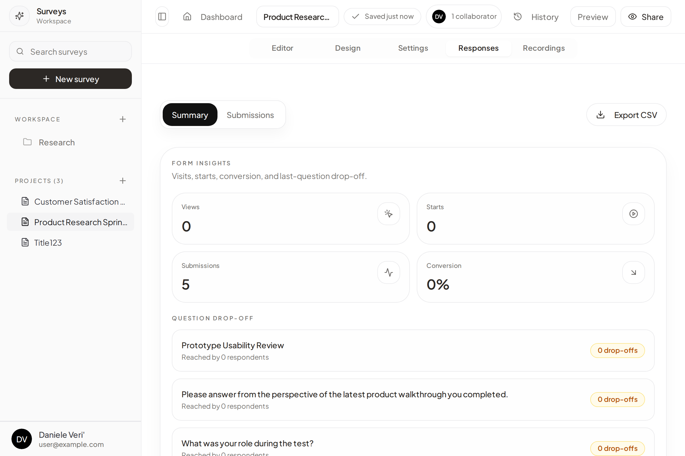
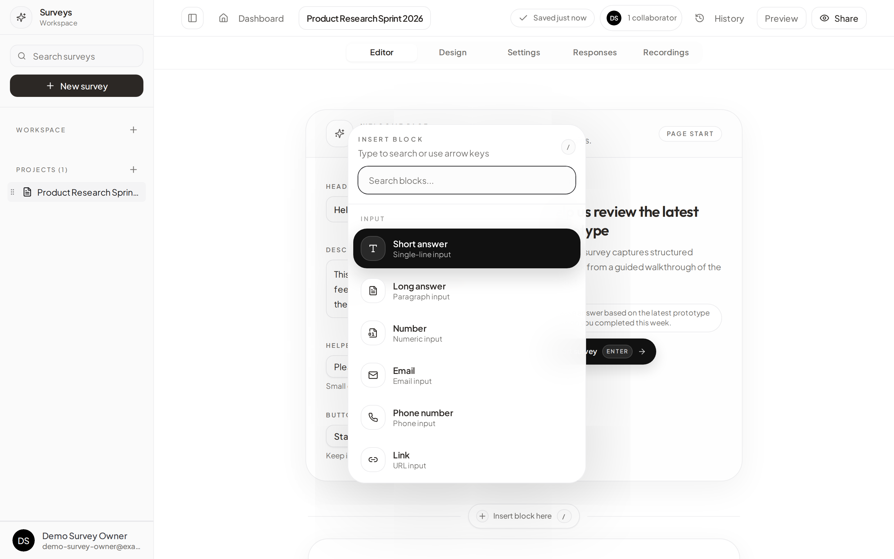
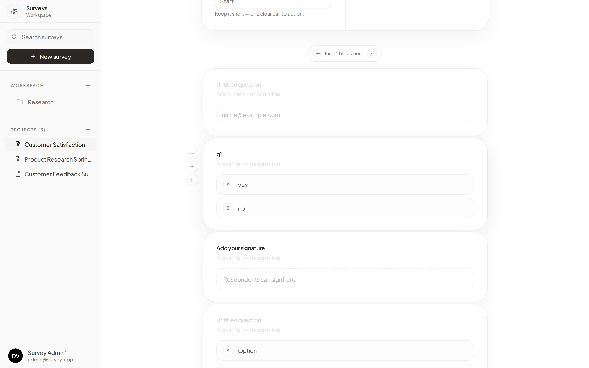

# Survey Builder

A self-hosted, open-source form and survey builder for teams who want full control over their data. Built with a React frontend and a Node.js/Express backend backed by PostgreSQL.

## Features Showcase

<p align="center">
  
</p>
<p align="center">
  
</p>
<p align="center">
  
</p>
<p align="center">
  
</p>
<p align="center">
  
</p>

---

## Features

- **Inline block editor** — Notion/Tally-style canvas. Click a block to edit it in place; a floating settings popover handles type-specific options without cluttering the canvas.
- **Rich block types** — short/long text, number, email, phone, date, time, URL, multiple choice, checkboxes, dropdown, multi-select, linear scale, rating, matrix, ranking, file upload, image, video, audio, embed, divider, headings, hidden fields, calculated fields.
- **Conditional logic** — per-block IF/THEN rules with AND/OR multi-condition support, show/hide, jump-to-page, calculate, require-answer, and disable-completion actions. Expands inline below the block.
- **Version history** — automatic snapshots on every save; restore any previous revision from the editor header.
- **Team collaboration** — teams with owner/admin/member roles, shared surveys and folders, real-time active-user indicators.
- **Recordings** — optional screen + webcam recording per response, with a dedicated Recordings tab and playback UI.
- **Response analytics** — per-question charts, CSV export, response filtering and tagging.
- **Custom domains** — map any hostname to a specific form via DNS verification.
- **Email notifications** — configurable per-survey notification emails via SMTP (Brevo or any relay).
- **Data retention** — configurable auto-purge policies per survey.
- **Delivery modes** — link, embed snippet, popup.
- **Admin approval flow** — new accounts require admin approval before access is granted.

---

## Technology Stack

| Layer | Technologies |
|---|---|
| Frontend | React 18, TypeScript, Vite, Tailwind CSS, shadcn/ui, TanStack Query, DND Kit |
| Backend | Node.js, Express, Prisma ORM |
| Database | PostgreSQL |
| Auth | JWT (access + refresh tokens) |
| Email | Nodemailer (SMTP) |
| Dev mail | Mailpit (local catcher) |

---

## Running with Docker (recommended)

The entire stack — Postgres, backend, and frontend — is defined in `docker-compose.yml`.

### 1. Environment variables

Copy and fill in the required values:

```bash
cp .env.example .env
```

Required:

```env
JWT_SECRET=<long random string>
SMTP_USER=<brevo or other SMTP username>
SMTP_PASS=<SMTP password>
```

Optional overrides (defaults shown):

```env
DATABASE_URL=postgresql://graphrag:graphrag@db:5432/postgres?schema=public
FRONTEND_URL=http://localhost:3000
VITE_API_URL=http://localhost:3001/api
SMTP_HOST=smtp-relay.brevo.com
SMTP_PORT=587
SMTP_FROM=noreply@yourdomain.com
```

### 2. Start

```bash
docker compose up --build
```

- Frontend: http://localhost:3000
- Backend API: http://localhost:3001/api
- Mailpit (dev email UI): not started by default — use `--profile dev` to enable it

```bash
# With local email catcher (nothing leaves the machine)
docker compose --profile dev up --build
# Mail UI at http://localhost:8025
```

### 3. First login

The first registered user is automatically given admin status and approved. Subsequent users require manual approval from the admin panel.

---

## Running locally (without Docker)

### Prerequisites

- Node.js 18+
- PostgreSQL 14+

### Setup

```bash
# Frontend dependencies
npm install

# Backend dependencies
npm --prefix server install

# Copy and configure environment
cp .env.example .env
# Set DATABASE_URL, JWT_SECRET, SMTP_* values

# Run database migrations
npx prisma migrate deploy --schema server/prisma/schema.prisma

# Start frontend dev server (Vite, port 3000)
npm run dev

# Start backend dev server (port 3001) — in a separate terminal
npm --prefix server run dev
```

---

## Project Structure

```
├── src/                        # Frontend (React)
│   ├── features/
│   │   ├── auth/               # Login, registration
│   │   ├── dashboard/          # Survey list, folder management
│   │   ├── survey-editor/      # Block editor, settings, responses, recordings
│   │   │   ├── components/     # Editor canvas, inline editor, popovers, cards
│   │   │   ├── hooks/          # useSurveyState, useAnswersTab, useSmartAutoSave
│   │   │   ├── lib/            # editor-blocks, editor-shortcuts, survey-appearance
│   │   │   └── pages/          # Editor.tsx (main editor page)
│   │   ├── survey-response/    # Public survey-taking interface
│   │   └── user/               # Profile, account settings
│   ├── hooks/                  # Shared hooks (surveys, teams, recordings)
│   ├── providers/auth/         # AuthProvider, authService, JWT handling
│   ├── services/team/          # Team mutation and query services
│   ├── types/                  # Shared TypeScript types (survey, database, etc.)
│   └── lib/                    # api.ts, logger.ts, survey-routes.ts
│
├── server/                     # Backend (Node.js / Express)
│   ├── src/
│   │   ├── controllers/        # auth, survey, team, custom-domains, insights, revisions
│   │   ├── validators/         # Zod request validators
│   │   ├── mailer.ts           # Nodemailer SMTP wrapper
│   │   └── app.ts              # Express app and route registration
│   ├── prisma/
│   │   ├── schema.prisma       # Database schema
│   │   └── migrations/         # Migration history
│   └── tests/                  # Backend Supertest suite
│
└── docker-compose.yml
```

---

## Testing

```bash
# Frontend unit tests (Vitest)
npm test

# Backend integration tests (Supertest)
npm --prefix server test
```

Backend test coverage includes: auth approval, survey ownership, invitation flow, recording upload, team invariants, public form access boundaries, sensitive error leakage, custom domains, survey insights, partial submissions, password-gated forms.

---

## Editor architecture

The editor uses an **inline block editing** model:

- Each block is rendered as a borderless card on the canvas (`QuestionInlineEditor`).
- Clicking a block selects it and opens a small **floating settings popover** to the left — block type, required toggle, type-specific options (badge style, scale labels, etc.), delete/duplicate/hide, turn into, bulk insert.
- **Conditional logic** opens as a full-width panel that expands directly below the active block, giving enough room for multi-condition rules.
- Blocks can be reordered via drag-and-drop (DND Kit) using the handle in the left gutter.
- A `BlockInserter` palette (triggered by the `+` button or `/` shortcut) lets you insert any block type at any position.

### Keyboard shortcuts (when a block is selected)

| Shortcut | Action |
|---|---|
| `Esc` | Deselect block |
| `Del` | Delete block |
| `⌘D` | Duplicate block |
| `⌘⇧H` | Toggle block visibility |
| `⌘⇧L` | Toggle conditional logic panel |
| `⌘⇧O` | Bulk insert options (choice blocks) |
| `/` | Open block inserter |

---

## API overview

All endpoints are prefixed with `/api`. Authentication uses a `Bearer` token in the `Authorization` header.

| Method | Path | Description |
|---|---|---|
| `POST` | `/auth/register` | Register a new user |
| `POST` | `/auth/login` | Login, returns JWT |
| `GET` | `/surveys` | List surveys for the authenticated user |
| `POST` | `/surveys` | Create a survey |
| `GET` | `/surveys/:id` | Get a single survey |
| `PUT` | `/surveys/:id` | Update a survey |
| `DELETE` | `/surveys/:id` | Delete a survey |
| `GET` | `/surveys/:id/revisions` | List version history |
| `POST` | `/surveys/:id/revisions/:revId/restore` | Restore a revision |
| `GET` | `/surveys/:id/responses` | List responses |
| `POST` | `/surveys/respond` | Submit a response (public) |
| `POST` | `/surveys/recordings/upload` | Upload a recording |
| `GET` | `/surveys/recordings/:id/file` | Stream a recording file |
| `GET` | `/surveys/public/:publicCode` | Get a published survey (public) |
| `GET` | `/teams` | List teams |
| `POST` | `/teams` | Create a team |
| `POST` | `/teams/:id/invite` | Invite a member |
| `GET` | `/custom-domains` | List custom domains |
| `POST` | `/custom-domains` | Register a custom domain |

The frontend uses a single `apiFetch` utility (`src/lib/api.ts`) that injects the JWT, handles base URL prefixing, and normalizes errors.
